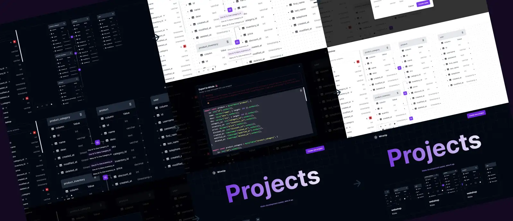

# [WireUp - Design databases with ease]([https://fitify-phi.vercel.app/](https://wireup.vercel.app/))

Built with the Next.js App Router, TypeScript, Tailwind, Ract Flow, Zustand.

## Todo 

- Create database schemas and being able to move them around
- [x] global state for it all with zustand
- [x] export schema in drizzle or prisma
